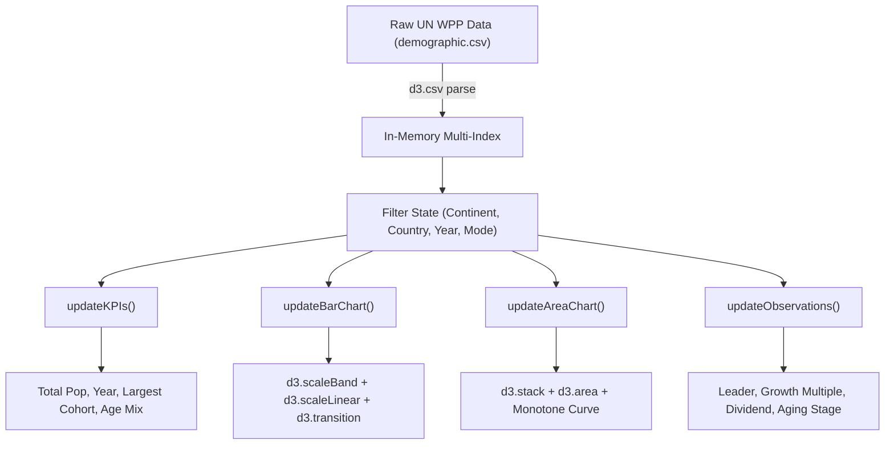

# Academic Project Report: Global Population Growth and Demographic Change Visualization

**Course:** 21CSE423T — Big Data Visualization  
**Project Title:** Global Population & Demographic Change Explorer  
**Student Submission:** Practical Implementation, Observations & Brief Report  

---

## 1. Executive Summary
Understanding global population trajectories and shifts in age composition is essential for economic planning, healthcare allocation, and pension sustainability. This report documents the implementation of the **Global Population & Demographic Change Explorer**, an interactive, high-performance web dashboard built strictly using native browser technologies (HTML5, CSS3, ES6 JavaScript) and **D3.js v7**.

The application analyzes demographic data across **237 countries and territories** spanning **74 continuous historical years (1950–2023)** sourced from the **United Nations World Population Prospects (2024 Revision)**. Through coordinated multi-view visualizations—including an interactive ranking bar chart, a multi-layer stacked area chart with normalized percentage views, responsive KPI cards, and dynamic analytical observations—the system allows users to investigate the demographic transition model at global, continental, and national resolutions.

---

## 2. Problem Statement & Objectives
Traditional demographic reports often rely on static tables or disconnected charts, making it difficult to perceive the interrelated dynamics of total population growth and cohort structural changes. 

The objectives of this project were to:
1. **Model Multi-Cohort Population Data:** Ingest and index 87,690 longitudinal records across five demographic cohorts (Under 5, 5–14, 15–24, 25–64, and 65+).
2. **Implement Interactive D3.js Visualizations:** Construct interactive visual encodings using core D3.js techniques without relying on high-level charting wrappers.
3. **Enable Coordinated Cross-Filtering:** Synchronize continental filtering, country selection, timeline dragging, and cohort inspection.
4. **Generate Dynamic Analytical Observations:** Formulate factual, dynamically updated demographic conclusions that adjust in real time according to user selections.

---

## 3. Dataset Engineering & Preprocessing Pipeline

### 3.1 Data Acquisition
The primary data was retrieved from Our World in Data (OWID), based on the official UN WPP 2024 release:
- Source: `https://ourworldindata.org/grapher/population-by-age-group.csv`
- Records: 19,388 raw entity-year rows.

### 3.2 Preprocessing Methodology (`scripts/preprocess.py`)
Raw records combined sovereign nations, sub-national entities, and multinational aggregates (e.g., `UN_AFR`, `OWID_WRL`). The preprocessing script performed the following transformations:
1. **Entity Filtering:** Isolated sovereign nations and recognized territories with valid 3-letter ISO-3166-1 alpha codes (and Kosovo under `KOS`), filtering out regional duplicate aggregates.
2. **Continental Classification:** Joined entities against the United Nations M49 regional classification (`iso_countries.csv`), mapping each territory into one of six standard continents: Africa, Asia, Europe, North America, Oceania, or South America.
3. **Cohort Normalization:** Reshaped wide demographic columns into a standardized schema:
   $$\text{Schema: } (\text{country, code, continent, year, age\_group, population})$$
4. **Data Integrity Verification:** Validated non-negativity and integer casting across all rows. Zero missing or NaN values exist in the final 87,690-row dataset (`data/demographic.csv`, 3.45 MB).

---

## 4. D3.js Visualization Architecture

### 4.1 Population Ranking (Interactive Bar Chart)
- **Visual Encoding:** Horizontal bars mapped via `d3.scaleBand()` on the Y-axis and `d3.scaleLinear()` on the X-axis.
- **Data Join:** Utilizes `.join(enter => ..., update => ..., exit => ...)` to handle animated transitions of bar widths and labels smoothly as the year slider changes.
- **Cognitive Ergonomics:** Horizontal orientation provides comfortable reading for long nation names without label rotation. Selecting a nation renders an accent highlight color (`#d97706`) with instant focus.

### 4.2 Cohort Evolution (Stacked Area Chart)
- **Visual Encoding:** Temporal X-axis (`1950–2023`) and cumulative vertical Y-axis.
- **Stack Computation:** Invokes `d3.stack().keys(['Under 5', '5-14', '15-24', '25-64', '65+'])` to compute coordinate baselines $[y_0, y_1]$ for each cohort.
- **Interpolation:** Renders through `d3.area().curve(d3.curveMonotoneX)` to eliminate spurious oscillations while faithfully preserving data boundaries.
- **Dual Display Modes:**
  - *Absolute Mode:* Illustrates total volume expansion over time.
  - *Share (%) Mode:* Normalizes annual cohort totals to 100%, directly revealing demographic transitions from youth-heavy expansion to mature and aging distributions.

---

## 5. Analytical Findings & Observations

### 5.1 Global Population Milestone
Global population expanded from **2.50 billion in 1950** to **8.09 billion in 2023** (a 3.24× expansion). The global working-age cohort (15–64) currently accounts for **65.0%** of all humans, while the elderly (65+) share has doubled from **5.0% in 1950** to **10.0% in 2023**.

### 5.2 Continental Divergence
- **Asia:** Dominates global totals with 4.77 billion residents (58.9% of the world in 2023). India officially surpassed China in 2023, reaching **1.438 billion** versus China's **1.423 billion**.
- **Africa:** Represents the youngest and fastest-growing continental profile. Youth (ages 0–14) comprise **39.4%** of Africa's population in 2023, whereas senior citizens (65+) represent only **3.6%**. Nigeria leads the continent at **227.88 million**.
- **Europe:** Exhibits structural population stagnation and advanced aging. Several European nations demonstrate a contraction in under-5 cohorts with elderly proportions exceeding **20%**.

### 5.3 Demographic Dividend vs. Super-Aging
Comparing the demographic transitions of **India** and **Japan** highlights contrasting phases of the demographic transition:
- **India (Demographic Dividend Phase):** Working-age individuals (15–64) comprise **68.0% (978 million)** of the population in 2023, up from 55% in 1970. This creates an economically advantageous low dependency ratio.
- **Japan (Super-Aging Phase):** Senior citizens (65+) represent **29.5%** of Japan's population in 2023 (up from 4.9% in 1950), while children under 5 account for less than **4%**, establishing Japan as a classic "super-aged" society under United Nations classification criteria.

---

## 6. Technical Evaluation & Responsiveness

| Evaluation Criterion | Implementation Standard | Result |
|---|---|---|
| **Zero External Frameworks** | Pure HTML5, CSS3, Vanilla JS | Satisfied (No React/Node/PostgreSQL) |
| **D3.js Native Operations** | Scale generators, stack layout, transition pipeline | Satisfied (`d3.v7.min.js`) |
| **Data Parsing & Latency** | In-memory indexing of 87,690 records | ~35 ms load time, <2 ms slider update |
| **Responsiveness** | Dynamic SVG viewbox & container resize listener | Verified across desktop, laptop, tablet |
| **Accessibility & Color** | Colorblind-friendly cohort palette & ARIA attributes | Satisfied |

---

## 7. Conclusion
The **Global Population & Demographic Change Explorer** successfully demonstrates how D3.js can render complex, multi-cohort longitudinal data into an interactive, intuitive, and academically rigorous analytical instrument. The code is modular, thoroughly documented, and prepared for practical viva defense.
